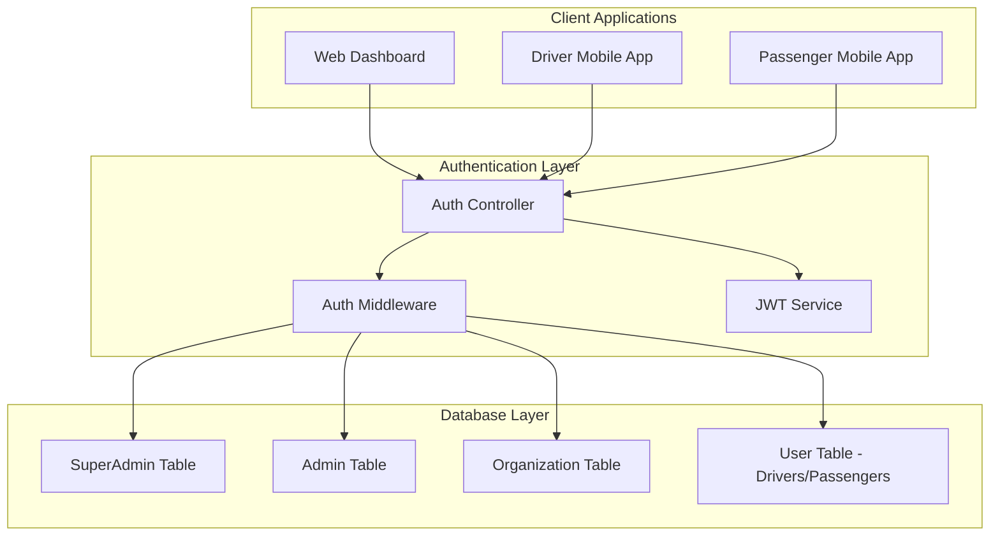
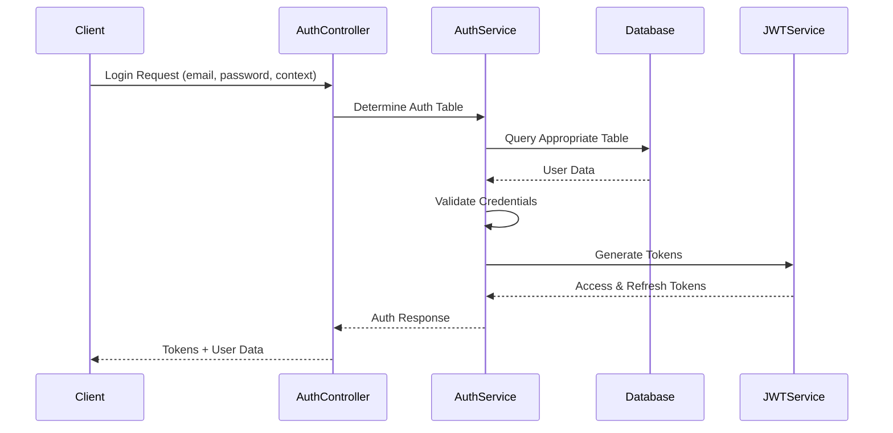

# Multi-Tier Authentication & Authorization System Design

## Overview

This design document outlines the technical approach for implementing a multi-tier authentication and authorization system for the Smart Public Transport Management (SPTM) platform. The system will restructure the current single-table User model into separate authentication entities with distinct access levels and responsibilities.

The design addresses the need for proper security boundaries between Super Admins, Admins, Organizations, Drivers, and Passengers, ensuring each tier has appropriate access controls and data isolation.

## Architecture

### High-Level Architecture



### Authentication Flow



## Components and Interfaces

### 1. Database Schema Updates

#### SuperAdmin Table
```typescript
model SuperAdmin {
  id                String   @id @default(cuid())
  email             String   @unique
  password          String
  name              String
  isActive          Boolean  @default(true)
  lastLoginAt       DateTime?
  refreshToken      String?
  createdAt         DateTime @default(now())
  updatedAt         DateTime @updatedAt
  
  // Audit fields
  createdBy         String?  // System or another super admin
  
  @@map("super_admins")
}
```

#### Admin Table
```typescript
model Admin {
  id                String   @id @default(cuid())
  email             String   @unique
  password          String
  name              String
  phone             String?
  isActive          Boolean  @default(true)
  lastLoginAt       DateTime?
  refreshToken      String?
  createdAt         DateTime @default(now())
  updatedAt         DateTime @updatedAt
  
  // Hierarchy
  createdBy         String   // SuperAdmin ID
  superAdmin        SuperAdmin @relation(fields: [createdBy], references: [id])
  
  // Relations
  organizations     Organization[]
  
  @@map("admins")
}
```

#### Updated Organization Table
```typescript
model Organization {
  id                String   @id @default(cuid())
  email             String   @unique
  password          String
  name              String
  phone             String?
  address           String?
  licenseNumber     String?  @unique
  isActive          Boolean  @default(true)
  lastLoginAt       DateTime?
  refreshToken      String?
  createdAt         DateTime @default(now())
  updatedAt         DateTime @updatedAt
  
  // Hierarchy
  createdBy         String   // Admin ID
  admin             Admin    @relation(fields: [createdBy], references: [id])
  
  // Relations
  users             User[]
  vehicles          Vehicle[]
  
  @@map("organizations")
}
```

#### Updated User Table (Drivers & Passengers)
```typescript
model User {
  id                String   @id @default(cuid())
  email             String   @unique
  password          String
  name              String?
  phone             String?
  role              UserRole @default(PASSENGER) // DRIVER or PASSENGER only
  isActive          Boolean  @default(true)
  isEmailVerified   Boolean  @default(false)
  emailVerifiedAt   DateTime?
  lastLoginAt       DateTime?
  refreshToken      String?
  createdAt         DateTime @default(now())
  updatedAt         DateTime @updatedAt
  
  // Organization relationship (required for drivers)
  organization      Organization? @relation(fields: [organizationId], references: [id])
  organizationId    String?
  
  // Relations
  trips             Trip[]
  discountProfile   DiscountProfile?
  verificationDocuments VerificationDocument[]
  
  @@map("users")
}
```

### 2. Authentication Service Layer

#### AuthService Interface
```typescript
interface AuthService {
  // Authentication methods
  authenticateSuperAdmin(email: string, password: string): Promise<AuthResult>
  authenticateAdmin(email: string, password: string): Promise<AuthResult>
  authenticateOrganization(email: string, password: string): Promise<AuthResult>
  authenticateUser(email: string, password: string, role: UserRole): Promise<AuthResult>
  
  // Token management
  generateTokens(payload: TokenPayload): TokenPair
  refreshTokens(refreshToken: string): Promise<TokenPair>
  revokeTokens(userId: string, userType: UserType): Promise<void>
  
  // Authorization
  validateAccess(token: string, requiredRole: string, organizationId?: string): Promise<boolean>
}
```

#### AuthResult Interface
```typescript
interface AuthResult {
  success: boolean
  user?: {
    id: string
    email: string
    name: string
    role: string
    userType: 'SUPER_ADMIN' | 'ADMIN' | 'ORGANIZATION' | 'USER'
    organizationId?: string
  }
  tokens?: {
    accessToken: string
    refreshToken: string
  }
  error?: string
}
```

### 3. Middleware Updates

#### Enhanced Authentication Middleware
```typescript
interface AuthRequest extends Request {
  user?: {
    id: string
    email: string
    role: string
    userType: 'SUPER_ADMIN' | 'ADMIN' | 'ORGANIZATION' | 'USER'
    organizationId?: string
  }
}

// Role hierarchy for access control
const ROLE_HIERARCHY = {
  SUPER_ADMIN: 4,
  ADMIN: 3,
  ORGANIZATION: 2,
  DRIVER: 1,
  PASSENGER: 1
}
```

#### Authorization Middleware Functions
```typescript
// Hierarchical role authorization
const authorizeRole = (minRole: string) => (req: AuthRequest, res: Response, next: NextFunction)

// Organization boundary enforcement
const authorizeOrganization = (req: AuthRequest, res: Response, next: NextFunction)

// Context-aware authorization (web vs mobile)
const authorizeContext = (allowedContexts: string[]) => (req: AuthRequest, res: Response, next: NextFunction)
```

### 4. Controller Layer Updates

#### Separate Authentication Controllers
- `SuperAdminAuthController` - Handles super admin authentication
- `AdminAuthController` - Handles admin authentication  
- `OrganizationAuthController` - Handles organization authentication
- `UserAuthController` - Handles driver/passenger authentication

#### Unified Auth Router
```typescript
// Route determination based on context
router.post('/auth/login', determineAuthContext, routeToAppropriateController)
router.post('/auth/web/login', webAuthController.login)
router.post('/auth/mobile/driver/login', driverAuthController.login)
router.post('/auth/mobile/passenger/login', passengerAuthController.login)
```

## Data Models

### Token Payload Structure
```typescript
interface TokenPayload {
  id: string
  email: string
  role: string
  userType: 'SUPER_ADMIN' | 'ADMIN' | 'ORGANIZATION' | 'USER'
  organizationId?: string
  permissions?: string[]
}
```

### Access Control Matrix
```typescript
const ACCESS_CONTROL_MATRIX = {
  SUPER_ADMIN: {
    canAccess: ['*'],
    canManage: ['admins', 'organizations', 'users', 'system'],
    organizationBoundary: false
  },
  ADMIN: {
    canAccess: ['organizations', 'users', 'routes', 'vehicles'],
    canManage: ['organizations', 'routes'],
    organizationBoundary: false
  },
  ORGANIZATION: {
    canAccess: ['drivers', 'vehicles', 'routes', 'trips'],
    canManage: ['drivers', 'vehicles'],
    organizationBoundary: true
  },
  DRIVER: {
    canAccess: ['own-profile', 'assigned-vehicle', 'assigned-routes'],
    canManage: ['own-profile'],
    organizationBoundary: true
  },
  PASSENGER: {
    canAccess: ['own-profile', 'trips', 'routes'],
    canManage: ['own-profile', 'discount-profile'],
    organizationBoundary: false
  }
}
```

## Error Handling

### Authentication Error Types
```typescript
enum AuthErrorType {
  INVALID_CREDENTIALS = 'INVALID_CREDENTIALS',
  ACCOUNT_INACTIVE = 'ACCOUNT_INACTIVE',
  INSUFFICIENT_PERMISSIONS = 'INSUFFICIENT_PERMISSIONS',
  ORGANIZATION_BOUNDARY_VIOLATION = 'ORGANIZATION_BOUNDARY_VIOLATION',
  TOKEN_EXPIRED = 'TOKEN_EXPIRED',
  TOKEN_INVALID = 'TOKEN_INVALID',
  CONTEXT_MISMATCH = 'CONTEXT_MISMATCH'
}
```

### Error Response Structure
```typescript
interface AuthErrorResponse {
  error: {
    type: AuthErrorType
    message: string
    code: number
    details?: any
  }
  timestamp: string
  path: string
}
```

### Security Considerations
- Never reveal which authentication table was queried
- Implement rate limiting per user type
- Log all authentication attempts with context
- Use different token expiration times per user type
- Implement account lockout policies per tier

## Testing Strategy

### Unit Tests
- Authentication service methods for each user type
- Token generation and validation
- Password hashing and comparison
- Role-based access control logic

### Integration Tests
- End-to-end authentication flows for each user type
- Cross-tier access control validation
- Organization boundary enforcement
- Token refresh and revocation flows

### Security Tests
- Brute force protection
- Token manipulation attempts
- Cross-tier privilege escalation attempts
- Organization data isolation validation

### Test Data Setup
```typescript
// Test user hierarchy
const testData = {
  superAdmin: { email: 'super@test.com', password: 'test123' },
  admin: { email: 'admin@test.com', password: 'test123', createdBy: 'super-admin-id' },
  organization: { email: 'org@test.com', password: 'test123', createdBy: 'admin-id' },
  driver: { email: 'driver@test.com', password: 'test123', organizationId: 'org-id' },
  passenger: { email: 'passenger@test.com', password: 'test123' }
}
```

### Performance Considerations
- Database indexing on email fields across all auth tables
- Connection pooling for multiple table queries
- Caching of role permissions and organization relationships
- Optimized JWT payload size to reduce token overhead

### Migration Strategy
1. Create new authentication tables alongside existing User table
2. Migrate existing users to appropriate tables based on current roles
3. Update authentication logic to use new table structure
4. Implement backward compatibility during transition period
5. Remove old authentication logic after validation