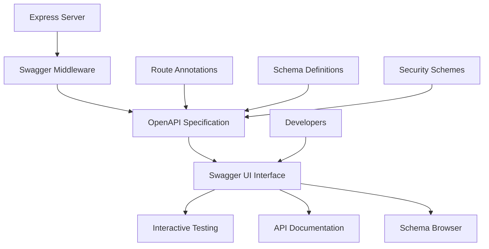

# Swagger API Documentation Design

## Overview

This design document outlines the implementation of comprehensive Swagger/OpenAPI documentation for the SPTM backend API. The solution will provide interactive API documentation accessible at `/api-docs`, with complete coverage of all authentication endpoints, mobile app endpoints, web dashboard endpoints, and proper documentation of the multi-tier authentication system.

## Architecture

### High-Level Architecture



### Component Architecture

1. **Swagger Integration Layer**
   - `swagger-jsdoc`: Generate OpenAPI spec from JSDoc comments
   - `swagger-ui-express`: Serve interactive Swagger UI
   - Custom configuration for SPTM-specific requirements

2. **Documentation Structure**
   - Authentication endpoints (multi-tier)
   - Mobile app endpoints (passenger/driver)
   - Web dashboard endpoints (admin hierarchy)
   - Utility endpoints (health, development)

3. **Schema Management**
   - Centralized schema definitions
   - Reusable components
   - Validation rule documentation

## Components and Interfaces

### 1. Swagger Configuration Module

**File**: `backend/src/config/swagger.ts`

```typescript
interface SwaggerConfig {
  definition: OpenAPIDefinition;
  apis: string[];
}

interface OpenAPIDefinition {
  openapi: string;
  info: APIInfo;
  servers: ServerInfo[];
  components: ComponentsSchema;
}
```

**Responsibilities**:
- Configure OpenAPI specification
- Define server information
- Set up security schemes
- Configure component schemas

### 2. Schema Definitions Module

**File**: `backend/src/schemas/apiSchemas.ts`

```typescript
interface APISchemas {
  User: UserSchema;
  AuthResponse: AuthResponseSchema;
  LoginRequest: LoginRequestSchema;
  RegisterRequest: RegisterRequestSchema;
  ErrorResponse: ErrorResponseSchema;
}
```

**Responsibilities**:
- Define all data model schemas
- Include validation rules
- Provide example values
- Document field constraints

### 3. Route Documentation

**Integration**: JSDoc comments in existing route files

```typescript
/**
 * @swagger
 * /api/auth/mobile/passenger/login:
 *   post:
 *     summary: Passenger mobile app login
 *     tags: [Mobile Authentication]
 *     requestBody:
 *       required: true
 *       content:
 *         application/json:
 *           schema:
 *             $ref: '#/components/schemas/LoginRequest'
 *     responses:
 *       200:
 *         description: Login successful
 *         content:
 *           application/json:
 *             schema:
 *               $ref: '#/components/schemas/AuthResponse'
 */
```

### 4. Swagger UI Customization

**File**: `backend/src/middleware/swaggerUI.ts`

```typescript
interface SwaggerUIOptions {
  customCss: string;
  customSiteTitle: string;
  swaggerOptions: SwaggerOptions;
}
```

**Responsibilities**:
- Customize UI appearance
- Configure authentication
- Set up try-it-out functionality
- Add custom branding

## Data Models

### Core Authentication Schemas

```yaml
components:
  schemas:
    User:
      type: object
      required:
        - id
        - email
        - name
        - role
        - userType
      properties:
        id:
          type: string
          description: Unique user identifier
          example: "cmik7w7h700037fm9zv7btfaz"
        email:
          type: string
          format: email
          description: User email address
          example: "user@example.com"
        name:
          type: string
          description: User full name
          example: "John Doe"
        role:
          type: string
          enum: [SUPER_ADMIN, ADMIN, ORGANIZATION, DRIVER, PASSENGER]
          description: User role in the system
        userType:
          type: string
          enum: [SUPER_ADMIN, ADMIN, ORGANIZATION, USER]
          description: User type for access control
        organizationId:
          type: string
          nullable: true
          description: Associated organization ID (for drivers)
        isActive:
          type: boolean
          description: Whether the user account is active
        createdAt:
          type: string
          format: date-time
          description: Account creation timestamp

    AuthResponse:
      type: object
      required:
        - message
        - user
        - tokens
      properties:
        message:
          type: string
          description: Success message
          example: "Login successful"
        user:
          $ref: '#/components/schemas/User'
        tokens:
          type: object
          required:
            - accessToken
            - refreshToken
          properties:
            accessToken:
              type: string
              description: JWT access token
              example: "eyJhbGciOiJIUzI1NiIsInR5cCI6IkpXVCJ9..."
            refreshToken:
              type: string
              description: JWT refresh token
              example: "eyJhbGciOiJIUzI1NiIsInR5cCI6IkpXVCJ9..."

    LoginRequest:
      type: object
      required:
        - email
        - password
      properties:
        email:
          type: string
          format: email
          description: User email address
          example: "user@example.com"
        password:
          type: string
          format: password
          description: User password
          example: "Password123!"

    RegisterRequest:
      type: object
      required:
        - email
        - password
        - name
      properties:
        email:
          type: string
          format: email
          description: User email address
          example: "user@example.com"
        password:
          type: string
          format: password
          minLength: 8
          description: User password (min 8 chars, must include uppercase, lowercase, numbers, special chars)
          example: "Password123!"
        name:
          type: string
          description: User full name
          example: "John Doe"
        phone:
          type: string
          nullable: true
          description: User phone number
          example: "+1234567890"
        role:
          type: string
          enum: [DRIVER, PASSENGER]
          description: User role (auto-set based on app context)
        organizationId:
          type: string
          nullable: true
          description: Organization ID (required for driver registration)

    ErrorResponse:
      type: object
      required:
        - error
        - timestamp
        - path
      properties:
        error:
          oneOf:
            - type: string
            - type: object
              properties:
                type:
                  type: string
                  description: Error type identifier
                message:
                  type: string
                  description: Human-readable error message
                code:
                  type: integer
                  description: HTTP status code
                details:
                  type: object
                  description: Additional error details
        timestamp:
          type: string
          format: date-time
          description: Error timestamp
        path:
          type: string
          description: API endpoint path where error occurred
```

### Security Schemes

```yaml
components:
  securitySchemes:
    BearerAuth:
      type: http
      scheme: bearer
      bearerFormat: JWT
      description: JWT token obtained from login endpoint
    
    AppContext:
      type: apiKey
      in: header
      name: X-App-Context
      description: Application context (passenger-app, driver-app, web-dashboard)
```

## Error Handling

### Error Response Documentation

All endpoints will document these standard error responses:

- **400 Bad Request**: Validation errors, malformed requests
- **401 Unauthorized**: Authentication failures, invalid tokens
- **403 Forbidden**: Authorization failures, insufficient permissions
- **404 Not Found**: Resource not found, invalid endpoints
- **409 Conflict**: Duplicate resources (email already exists)
- **422 Unprocessable Entity**: Validation failures
- **429 Too Many Requests**: Rate limiting exceeded
- **500 Internal Server Error**: Server-side errors

### Error Schema Examples

```yaml
examples:
  ValidationError:
    summary: Validation error example
    value:
      error:
        type: "WEAK_PASSWORD"
        message: "Password does not meet security requirements"
        code: 400
        details:
          requirements:
            - "Password must contain at least one uppercase letter"
            - "Password must contain at least one special character"
      timestamp: "2025-11-29T12:00:00.000Z"
      path: "/api/auth/register"
  
  EmailExistsError:
    summary: Email already exists error
    value:
      error: "User already exists with this email"
      timestamp: "2025-11-29T12:00:00.000Z"
      path: "/api/auth/register"
  
  RateLimitError:
    summary: Rate limit exceeded error
    value:
      error:
        type: "RATE_LIMIT_EXCEEDED"
        message: "Too many requests"
        code: 429
        details:
          retryAfter: 300
      timestamp: "2025-11-29T12:00:00.000Z"
      path: "/api/auth/login"
```

## Testing Strategy

### Documentation Testing

1. **Schema Validation**
   - Validate all schema definitions
   - Ensure examples match schemas
   - Test required/optional field documentation

2. **Endpoint Coverage**
   - Verify all routes are documented
   - Check parameter documentation accuracy
   - Validate response schema completeness

3. **Interactive Testing**
   - Test "Try it out" functionality
   - Verify authentication flow
   - Check error response accuracy

### Integration Testing

1. **Swagger UI Loading**
   - Verify UI loads correctly
   - Check all endpoints are visible
   - Validate schema browser functionality

2. **Authentication Testing**
   - Test token-based authentication
   - Verify context header requirements
   - Check multi-tier access documentation

## Detailed API Endpoint Documentation

### Authentication Endpoints Structure

Based on the current backend implementation, the following endpoints need documentation:

#### Web Dashboard Authentication
```yaml
paths:
  /api/auth/web/super-admin/login:
    post:
      tags: [Web Dashboard Authentication]
      summary: Super Admin login for web dashboard
      description: Authenticates super admin users for web dashboard access
      security: []
      parameters:
        - in: header
          name: X-App-Context
          required: true
          schema:
            type: string
            enum: [web-dashboard]
      requestBody:
        required: true
        content:
          application/json:
            schema:
              $ref: '#/components/schemas/LoginRequest'
            examples:
              superAdminLogin:
                summary: Super Admin Login
                value:
                  email: "superadmin@sptm.com"
                  password: "SuperSecure123!"
      responses:
        200:
          description: Login successful
          content:
            application/json:
              schema:
                $ref: '#/components/schemas/AuthResponse'
        400:
          $ref: '#/components/responses/ValidationError'
        401:
          $ref: '#/components/responses/AuthenticationError'
        429:
          $ref: '#/components/responses/RateLimitError'

  /api/auth/web/admin/login:
    post:
      tags: [Web Dashboard Authentication]
      summary: Admin login for web dashboard
      description: Authenticates admin users for web dashboard access
      security: []
      parameters:
        - in: header
          name: X-App-Context
          required: true
          schema:
            type: string
            enum: [web-dashboard]
      requestBody:
        required: true
        content:
          application/json:
            schema:
              $ref: '#/components/schemas/LoginRequest'
      responses:
        200:
          description: Login successful
          content:
            application/json:
              schema:
                $ref: '#/components/schemas/AuthResponse'
        400:
          $ref: '#/components/responses/ValidationError'
        401:
          $ref: '#/components/responses/AuthenticationError'
        429:
          $ref: '#/components/responses/RateLimitError'

  /api/auth/web/organization/login:
    post:
      tags: [Web Dashboard Authentication]
      summary: Organization login for web dashboard
      description: Authenticates organization users for web dashboard access
      security: []
      parameters:
        - in: header
          name: X-App-Context
          required: true
          schema:
            type: string
            enum: [web-dashboard]
      requestBody:
        required: true
        content:
          application/json:
            schema:
              $ref: '#/components/schemas/LoginRequest'
      responses:
        200:
          description: Login successful
          content:
            application/json:
              schema:
                $ref: '#/components/schemas/AuthResponse'
        400:
          $ref: '#/components/responses/ValidationError'
        401:
          $ref: '#/components/responses/AuthenticationError'
        429:
          $ref: '#/components/responses/RateLimitError'
```

#### Mobile App Authentication
```yaml
  /api/auth/mobile/driver/login:
    post:
      tags: [Mobile App Authentication]
      summary: Driver login for mobile app
      description: Authenticates driver users for mobile app access
      security: []
      parameters:
        - in: header
          name: X-App-Context
          required: true
          schema:
            type: string
            enum: [driver-app]
      requestBody:
        required: true
        content:
          application/json:
            schema:
              $ref: '#/components/schemas/LoginRequest'
            examples:
              driverLogin:
                summary: Driver Login
                value:
                  email: "driver@transport.com"
                  password: "DriverPass123!"
      responses:
        200:
          description: Login successful
          content:
            application/json:
              schema:
                $ref: '#/components/schemas/AuthResponse'
        400:
          $ref: '#/components/responses/ValidationError'
        401:
          $ref: '#/components/responses/AuthenticationError'
        429:
          $ref: '#/components/responses/RateLimitError'

  /api/auth/mobile/driver/register:
    post:
      tags: [Mobile App Authentication]
      summary: Driver registration for mobile app
      description: Registers new driver users for mobile app access
      security: []
      parameters:
        - in: header
          name: X-App-Context
          required: true
          schema:
            type: string
            enum: [driver-app]
      requestBody:
        required: true
        content:
          application/json:
            schema:
              $ref: '#/components/schemas/DriverRegisterRequest'
            examples:
              driverRegister:
                summary: Driver Registration
                value:
                  email: "newdriver@transport.com"
                  password: "SecurePass123!"
                  name: "John Driver"
                  phone: "+1234567890"
                  organizationId: "org_123456789"
      responses:
        201:
          description: Registration successful
          content:
            application/json:
              schema:
                $ref: '#/components/schemas/AuthResponse'
        400:
          $ref: '#/components/responses/ValidationError'
        409:
          $ref: '#/components/responses/ConflictError'
        429:
          $ref: '#/components/responses/RateLimitError'

  /api/auth/mobile/passenger/login:
    post:
      tags: [Mobile App Authentication]
      summary: Passenger login for mobile app
      description: Authenticates passenger users for mobile app access
      security: []
      parameters:
        - in: header
          name: X-App-Context
          required: true
          schema:
            type: string
            enum: [passenger-app]
      requestBody:
        required: true
        content:
          application/json:
            schema:
              $ref: '#/components/schemas/LoginRequest'
      responses:
        200:
          description: Login successful
          content:
            application/json:
              schema:
                $ref: '#/components/schemas/AuthResponse'
        400:
          $ref: '#/components/responses/ValidationError'
        401:
          $ref: '#/components/responses/AuthenticationError'
        429:
          $ref: '#/components/responses/RateLimitError'

  /api/auth/mobile/passenger/register:
    post:
      tags: [Mobile App Authentication]
      summary: Passenger registration for mobile app
      description: Registers new passenger users for mobile app access
      security: []
      parameters:
        - in: header
          name: X-App-Context
          required: true
          schema:
            type: string
            enum: [passenger-app]
      requestBody:
        required: true
        content:
          application/json:
            schema:
              $ref: '#/components/schemas/PassengerRegisterRequest'
      responses:
        201:
          description: Registration successful
          content:
            application/json:
              schema:
                $ref: '#/components/schemas/AuthResponse'
        400:
          $ref: '#/components/responses/ValidationError'
        409:
          $ref: '#/components/responses/ConflictError'
        429:
          $ref: '#/components/responses/RateLimitError'
```

#### Token Management Endpoints
```yaml
  /api/auth/web/super-admin/refresh-token:
    post:
      tags: [Token Management]
      summary: Refresh super admin access token
      security:
        - BearerAuth: []
      parameters:
        - in: header
          name: X-App-Context
          required: true
          schema:
            type: string
            enum: [web-dashboard]
      responses:
        200:
          description: Token refreshed successfully
          content:
            application/json:
              schema:
                $ref: '#/components/schemas/TokenResponse'
        401:
          $ref: '#/components/responses/AuthenticationError'

  /api/auth/logout:
    post:
      tags: [Authentication]
      summary: Universal logout endpoint
      description: Logs out user from any context (always succeeds)
      security: []
      responses:
        200:
          description: Logout successful
          content:
            application/json:
              schema:
                type: object
                properties:
                  message:
                    type: string
                    example: "Logout successful"
```

#### Protected Endpoints
```yaml
  /api/auth/me:
    get:
      tags: [User Profile]
      summary: Get current user information
      description: Returns information about the currently authenticated user
      security:
        - BearerAuth: []
      responses:
        200:
          description: User information retrieved successfully
          content:
            application/json:
              schema:
                $ref: '#/components/schemas/User'
        401:
          $ref: '#/components/responses/AuthenticationError'

  /api/auth/profile:
    get:
      tags: [User Profile]
      summary: Get user profile
      description: Returns detailed profile information for the authenticated user
      security:
        - BearerAuth: []
      responses:
        200:
          description: Profile retrieved successfully
          content:
            application/json:
              schema:
                $ref: '#/components/schemas/UserProfile'
        401:
          $ref: '#/components/responses/AuthenticationError'

  /api/auth/change-password:
    put:
      tags: [User Profile]
      summary: Change user password
      description: Allows authenticated users to change their password
      security:
        - BearerAuth: []
      requestBody:
        required: true
        content:
          application/json:
            schema:
              $ref: '#/components/schemas/ChangePasswordRequest'
      responses:
        200:
          description: Password changed successfully
          content:
            application/json:
              schema:
                type: object
                properties:
                  message:
                    type: string
                    example: "Password changed successfully"
        400:
          $ref: '#/components/responses/ValidationError'
        401:
          $ref: '#/components/responses/AuthenticationError'
```

#### Public Endpoints
```yaml
  /api/auth/organizations/active:
    get:
      tags: [Public]
      summary: Get active organizations
      description: Returns list of active organizations for driver registration
      security: []
      responses:
        200:
          description: Active organizations retrieved successfully
          content:
            application/json:
              schema:
                type: array
                items:
                  $ref: '#/components/schemas/Organization'
        500:
          $ref: '#/components/responses/ServerError'

  /health:
    get:
      tags: [System]
      summary: Health check endpoint
      description: Returns system health status
      security: []
      responses:
        200:
          description: System is healthy
          content:
            application/json:
              schema:
                type: object
                properties:
                  status:
                    type: string
                    example: "OK"
                  message:
                    type: string
                    example: "SPTM Backend is running"
                  timestamp:
                    type: string
                    format: date-time
```

## Extended Schema Definitions

### Additional Request/Response Schemas

```yaml
components:
  schemas:
    DriverRegisterRequest:
      type: object
      required:
        - email
        - password
        - name
        - organizationId
      properties:
        email:
          type: string
          format: email
          description: Driver email address
          example: "driver@transport.com"
        password:
          type: string
          format: password
          minLength: 8
          description: Driver password (min 8 chars, must include uppercase, lowercase, numbers, special chars)
          example: "DriverPass123!"
        name:
          type: string
          description: Driver full name
          example: "John Driver"
        phone:
          type: string
          nullable: true
          description: Driver phone number
          example: "+1234567890"
        organizationId:
          type: string
          description: Organization ID that the driver belongs to
          example: "org_123456789"

    PassengerRegisterRequest:
      type: object
      required:
        - email
        - password
        - name
      properties:
        email:
          type: string
          format: email
          description: Passenger email address
          example: "passenger@example.com"
        password:
          type: string
          format: password
          minLength: 8
          description: Passenger password (min 8 chars, must include uppercase, lowercase, numbers, special chars)
          example: "PassengerPass123!"
        name:
          type: string
          description: Passenger full name
          example: "Jane Passenger"
        phone:
          type: string
          nullable: true
          description: Passenger phone number
          example: "+1234567890"

    ChangePasswordRequest:
      type: object
      required:
        - currentPassword
        - newPassword
      properties:
        currentPassword:
          type: string
          format: password
          description: Current password
          example: "OldPassword123!"
        newPassword:
          type: string
          format: password
          minLength: 8
          description: New password (min 8 chars, must include uppercase, lowercase, numbers, special chars)
          example: "NewPassword123!"

    TokenResponse:
      type: object
      required:
        - accessToken
        - refreshToken
      properties:
        accessToken:
          type: string
          description: New JWT access token
          example: "eyJhbGciOiJIUzI1NiIsInR5cCI6IkpXVCJ9..."
        refreshToken:
          type: string
          description: New JWT refresh token
          example: "eyJhbGciOiJIUzI1NiIsInR5cCI6IkpXVCJ9..."

    UserProfile:
      type: object
      properties:
        id:
          type: string
          description: Unique user identifier
          example: "cmik7w7h700037fm9zv7btfaz"
        email:
          type: string
          format: email
          description: User email address
          example: "user@example.com"
        name:
          type: string
          description: User full name
          example: "John Doe"
        phone:
          type: string
          nullable: true
          description: User phone number
          example: "+1234567890"
        role:
          type: string
          enum: [SUPER_ADMIN, ADMIN, ORGANIZATION, DRIVER, PASSENGER]
          description: User role in the system
        userType:
          type: string
          enum: [SUPER_ADMIN, ADMIN, ORGANIZATION, USER]
          description: User type for access control
        organizationId:
          type: string
          nullable: true
          description: Associated organization ID
        organization:
          $ref: '#/components/schemas/Organization'
          nullable: true
        isActive:
          type: boolean
          description: Whether the user account is active
        createdAt:
          type: string
          format: date-time
          description: Account creation timestamp
        updatedAt:
          type: string
          format: date-time
          description: Last update timestamp

    Organization:
      type: object
      properties:
        id:
          type: string
          description: Unique organization identifier
          example: "org_123456789"
        name:
          type: string
          description: Organization name
          example: "City Transport Authority"
        email:
          type: string
          format: email
          description: Organization contact email
          example: "contact@citytransport.com"
        isActive:
          type: boolean
          description: Whether the organization is active
          example: true
        createdAt:
          type: string
          format: date-time
          description: Organization creation timestamp
        updatedAt:
          type: string
          format: date-time
          description: Last update timestamp

  responses:
    ValidationError:
      description: Validation error
      content:
        application/json:
          schema:
            $ref: '#/components/schemas/ErrorResponse'
          examples:
            weakPassword:
              summary: Weak password error
              value:
                error:
                  type: "WEAK_PASSWORD"
                  message: "Password does not meet security requirements"
                  code: 400
                  details:
                    requirements:
                      - "Password must contain at least one uppercase letter"
                      - "Password must contain at least one special character"
                timestamp: "2025-11-29T12:00:00.000Z"
                path: "/api/auth/register"
            missingFields:
              summary: Missing required fields
              value:
                error: "Validation failed: email is required, password is required"
                timestamp: "2025-11-29T12:00:00.000Z"
                path: "/api/auth/login"

    AuthenticationError:
      description: Authentication failed
      content:
        application/json:
          schema:
            $ref: '#/components/schemas/ErrorResponse'
          examples:
            invalidCredentials:
              summary: Invalid credentials
              value:
                error: "Invalid email or password"
                timestamp: "2025-11-29T12:00:00.000Z"
                path: "/api/auth/login"
            expiredToken:
              summary: Expired token
              value:
                error: "Token has expired"
                timestamp: "2025-11-29T12:00:00.000Z"
                path: "/api/auth/me"

    ConflictError:
      description: Resource conflict
      content:
        application/json:
          schema:
            $ref: '#/components/schemas/ErrorResponse'
          examples:
            emailExists:
              summary: Email already exists
              value:
                error: "User already exists with this email"
                timestamp: "2025-11-29T12:00:00.000Z"
                path: "/api/auth/register"

    RateLimitError:
      description: Rate limit exceeded
      content:
        application/json:
          schema:
            $ref: '#/components/schemas/ErrorResponse'
          examples:
            rateLimitExceeded:
              summary: Rate limit exceeded
              value:
                error:
                  type: "RATE_LIMIT_EXCEEDED"
                  message: "Too many requests"
                  code: 429
                  details:
                    retryAfter: 300
                timestamp: "2025-11-29T12:00:00.000Z"
                path: "/api/auth/login"

    ServerError:
      description: Internal server error
      content:
        application/json:
          schema:
            $ref: '#/components/schemas/ErrorResponse'
          examples:
            internalError:
              summary: Internal server error
              value:
                error: "Internal server error"
                timestamp: "2025-11-29T12:00:00.000Z"
                path: "/api/auth/organizations/active"
```

## Implementation Plan

### Phase 1: Core Setup and Dependencies
1. Install swagger dependencies (`swagger-jsdoc`, `swagger-ui-express`)
2. Create swagger configuration module
3. Set up basic OpenAPI specification
4. Integrate Swagger UI endpoint at `/api-docs`
5. Configure security schemes and server information

### Phase 2: Schema Definitions
1. Create comprehensive schema definitions module
2. Define all request/response schemas
3. Add validation rules and examples
4. Create reusable error response schemas
5. Set up component references

### Phase 3: Authentication Documentation
1. Document all unified authentication routes
2. Add context-specific authentication flows
3. Document multi-tier login system
4. Add token management endpoints
5. Include security scheme examples

### Phase 4: Mobile App Documentation
1. Document driver app specific endpoints
2. Document passenger app specific endpoints
3. Add mobile context validation examples
4. Include organization selection flow
5. Document mobile-specific error scenarios

### Phase 5: Web Dashboard Documentation
1. Document super admin endpoints
2. Document admin endpoints
3. Document organization endpoints
4. Add hierarchical access examples
5. Include permission-based documentation

### Phase 6: Enhancement and Testing
1. Add comprehensive error documentation
2. Implement custom UI styling
3. Add interactive testing capabilities
4. Perform thorough validation
5. Add development vs production configurations

## Security Considerations

### Documentation Security

1. **Sensitive Information**
   - Exclude actual production tokens from examples
   - Use placeholder values for sensitive data
   - Document security best practices

2. **Access Control**
   - Document authentication requirements clearly
   - Explain authorization levels
   - Include security warnings where appropriate

3. **Rate Limiting Documentation**
   - Document rate limits for each endpoint
   - Explain retry mechanisms
   - Include rate limit error examples

## Deployment and Maintenance

### Development Environment
- Swagger UI available at `http://localhost:3001/api-docs`
- Auto-reload on schema changes
- Development-specific examples and notes

### Production Environment
- Swagger UI available at production domain
- Production-appropriate examples
- Security-focused documentation

### Maintenance Strategy
- Keep documentation in sync with code changes
- Regular review of examples and schemas
- Update documentation with new features
- Monitor documentation usage and feedback